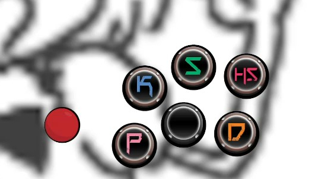
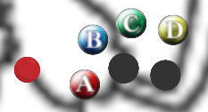
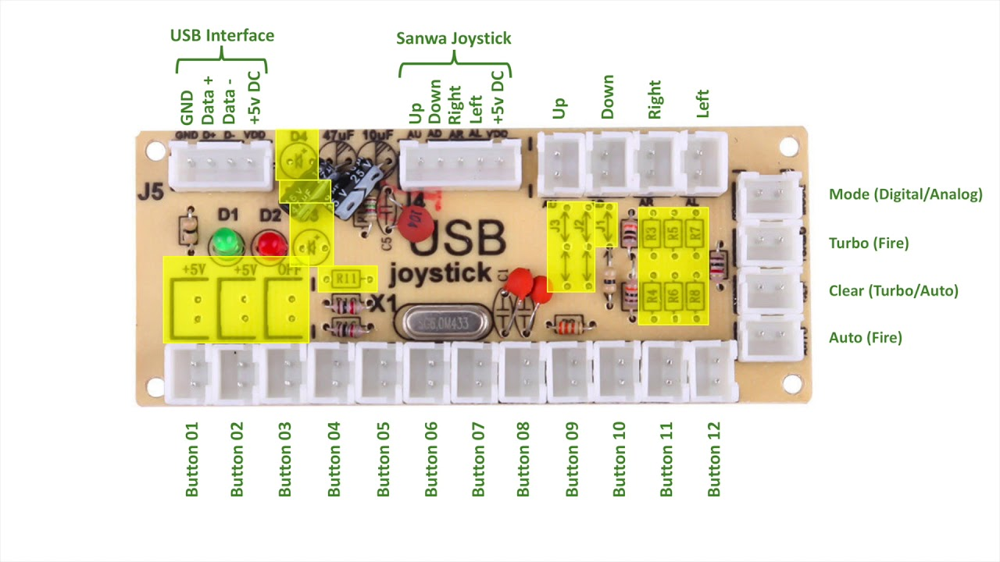

### Portable configurations for the page  https://gamepadviewer.com/ intended for OBS or derivates usage.

# Xrd

Type - A



```
https://gamepadviewer.com/?p=1&s=7&editcss=https://raw.githubusercontent.com/OriolFilter/arcade_layout/master/xrd_A.css
```


# BBCF

Type - A



```
https://gamepadviewer.com/?p=1&s=7&editcss=https://raw.githubusercontent.com/OriolFilter/arcade_layout/master/bbcf_A.css
```

# Controller mappings

The page one can remap buttons, allowing you to customize which button triggers what.
Here are the customized mappings done for the pcbs that requiered customization (keep in mind that if the wiring differs will do the result)

If the result isn't the desired one, feel free to do your own customizations.


### Cheap USB encoder



Due it registering the input as a left joystick instead of the dpad, had to bind the joystick inputs to the dpad ones.
Also had to remap some buttons.


Add this to the url so it can add the new variables.

```
&map=%7B%22mapping%22%3A%5B%7B%22targetType%22%3A%22buttons%22%2C%22target%22%3A%220%22%2C%22disabled%22%3Afalse%2C%22choiceType%22%3A%22buttons%22%2C%22choice%22%3A%222%22%7D%2C%7B%22targetType%22%3A%22buttons%22%2C%22target%22%3A%221%22%2C%22disabled%22%3Afalse%2C%22choiceType%22%3A%22buttons%22%2C%22choice%22%3A%221%22%7D%2C%7B%22targetType%22%3A%22buttons%22%2C%22target%22%3A%222%22%2C%22disabled%22%3Afalse%2C%22choiceType%22%3A%22buttons%22%2C%22choice%22%3A%223%22%7D%2C%7B%22targetType%22%3A%22buttons%22%2C%22target%22%3A%223%22%2C%22disabled%22%3Afalse%2C%22choiceType%22%3A%22buttons%22%2C%22choice%22%3A%220%22%7D%2C%7B%22targetType%22%3A%22buttons%22%2C%22target%22%3A%2212%22%2C%22disabled%22%3Afalse%2C%22choiceOperand%22%3A%22-%22%2C%22choiceType%22%3A%22axes%22%2C%22choice%22%3A%221%22%7D%2C%7B%22targetType%22%3A%22buttons%22%2C%22target%22%3A%2213%22%2C%22disabled%22%3Afalse%2C%22choiceOperand%22%3A%22%2B%22%2C%22choiceType%22%3A%22axes%22%2C%22choice%22%3A%221%22%7D%2C%7B%22targetType%22%3A%22buttons%22%2C%22target%22%3A%2214%22%2C%22disabled%22%3Afalse%2C%22choiceOperand%22%3A%22-%22%2C%22choiceType%22%3A%22axes%22%2C%22choice%22%3A%220%22%7D%2C%7B%22targetType%22%3A%22buttons%22%2C%22target%22%3A%2215%22%2C%22disabled%22%3Afalse%2C%22choiceOperand%22%3A%22%2B%22%2C%22choiceType%22%3A%22axes%22%2C%22choice%22%3A%220%22%7D%5D%7D
```

So xrd type A with that variable results in: 

```
https://gamepadviewer.com/?p=1&s=7&editcss=https://raw.githubusercontent.com/OriolFilter/arcade_layout/master/xrd_A.css&map=%7B%22mapping%22%3A%5B%7B%22targetType%22%3A%22buttons%22%2C%22target%22%3A%220%22%2C%22disabled%22%3Afalse%2C%22choiceType%22%3A%22buttons%22%2C%22choice%22%3A%222%22%7D%2C%7B%22targetType%22%3A%22buttons%22%2C%22target%22%3A%221%22%2C%22disabled%22%3Afalse%2C%22choiceType%22%3A%22buttons%22%2C%22choice%22%3A%221%22%7D%2C%7B%22targetType%22%3A%22buttons%22%2C%22target%22%3A%222%22%2C%22disabled%22%3Afalse%2C%22choiceType%22%3A%22buttons%22%2C%22choice%22%3A%223%22%7D%2C%7B%22targetType%22%3A%22buttons%22%2C%22target%22%3A%223%22%2C%22disabled%22%3Afalse%2C%22choiceType%22%3A%22buttons%22%2C%22choice%22%3A%220%22%7D%2C%7B%22targetType%22%3A%22buttons%22%2C%22target%22%3A%2212%22%2C%22disabled%22%3Afalse%2C%22choiceOperand%22%3A%22-%22%2C%22choiceType%22%3A%22axes%22%2C%22choice%22%3A%221%22%7D%2C%7B%22targetType%22%3A%22buttons%22%2C%22target%22%3A%2213%22%2C%22disabled%22%3Afalse%2C%22choiceOperand%22%3A%22%2B%22%2C%22choiceType%22%3A%22axes%22%2C%22choice%22%3A%221%22%7D%2C%7B%22targetType%22%3A%22buttons%22%2C%22target%22%3A%2214%22%2C%22disabled%22%3Afalse%2C%22choiceOperand%22%3A%22-%22%2C%22choiceType%22%3A%22axes%22%2C%22choice%22%3A%220%22%7D%2C%7B%22targetType%22%3A%22buttons%22%2C%22target%22%3A%2215%22%2C%22disabled%22%3Afalse%2C%22choiceOperand%22%3A%22%2B%22%2C%22choiceType%22%3A%22axes%22%2C%22choice%22%3A%220%22%7D%5D%7D
```

# Disclaimer, i have nothing to do with the page https://gamepadviewer.com/

### Also, feel free to ask for configurations 